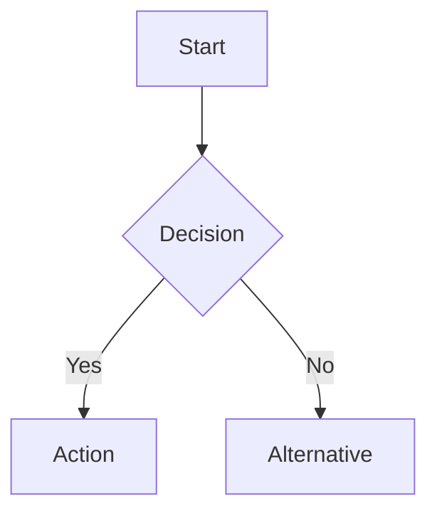
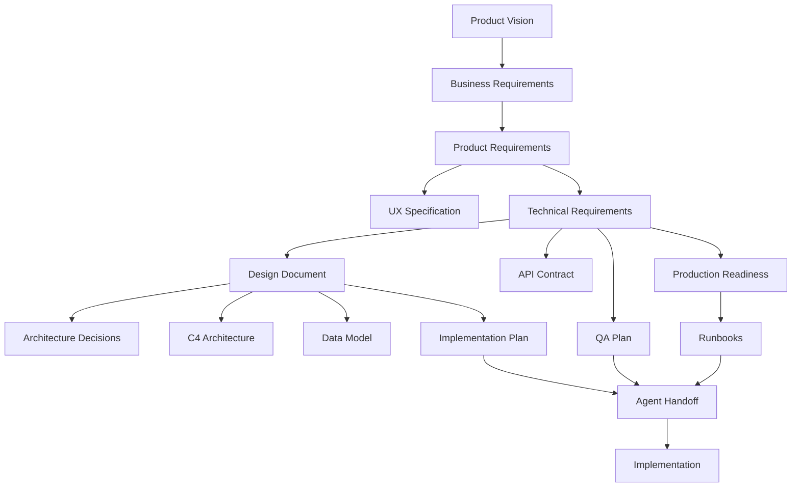

# Pre-Development Documentation Framework

> **Purpose**: Complete documentation suite to hand to an autonomous AI agent so it can build a world-class system from scratch. This framework defines every document type needed before any code is written.

---

## Executive Summary

This framework organizes pre-development documentation into **7 layers**, progressing from business context to implementation-ready specifications. An autonomous AI agent receiving this complete documentation suite would have everything needed to build a production-grade system.

```
Layer 1: Vision & Strategy     (WHY are we building this?)
Layer 2: Product Requirements  (WHAT are we building?)
Layer 3: Technical Design      (HOW will we build it?)
Layer 4: Architecture          (WHERE do pieces fit?)
Layer 5: Quality & Operations  (HOW will we run it?)
Layer 6: Implementation Plan   (WHEN/WHAT order?)
Layer 7: Agent Handoff         (WHO builds it - AI context)
```

---

## Layer 1: Vision & Strategy Documents

### 1.1 Product Vision Document (PVD)

**Purpose**: North star alignment - why this product exists

**Template**:
```markdown
# Product Vision: [Product Name]

## Vision Statement
[One sentence: What world are we creating?]

## Problem Statement
- **Who** has the problem?
- **What** is the problem?
- **Why** does it matter?
- **How** are they solving it today?

## Target Users
| Persona | Role | Pain Points | Goals |
|---------|------|-------------|-------|
| [Name]  | [Role] | [Pains] | [Goals] |

## Success Metrics
| Metric | Current | Target | Timeline |
|--------|---------|--------|----------|
| [KPI]  | [Now]   | [Goal] | [When]   |

## Strategic Alignment
- Company strategy connection
- Market opportunity
- Competitive differentiation

## Non-Goals (Explicitly Out of Scope)
- [What we are NOT building]
```

**Owner**: Product Manager / Founder
**When**: Before any other document

---

### 1.2 Business Requirements Document (BRD)

**Purpose**: Business justification and constraints

**Template**:
```markdown
# Business Requirements: [Feature/Product]

## Business Objectives
1. [Objective with measurable outcome]
2. [Objective with measurable outcome]

## Stakeholders
| Stakeholder | Interest | Influence | Requirements |
|-------------|----------|-----------|--------------|
| [Name/Role] | [What they care about] | [H/M/L] | [Their needs] |

## Business Constraints
- **Budget**: [Amount]
- **Timeline**: [Deadline and why]
- **Resources**: [Team availability]
- **Regulatory**: [Compliance requirements]
- **Dependencies**: [External systems/teams]

## ROI Analysis
- **Investment**: [Cost]
- **Expected Return**: [Value]
- **Payback Period**: [Timeline]

## Risk Assessment
| Risk | Probability | Impact | Mitigation |
|------|-------------|--------|------------|
| [Risk] | [H/M/L] | [H/M/L] | [Strategy] |
```

**Owner**: Business Analyst / Product Manager
**When**: After PVD, before PRD

---

## Layer 2: Product Requirements Documents

### 2.1 Product Requirements Document (PRD)

**Purpose**: Complete feature specification from user perspective

**Template** (Based on [industry best practices](https://productschool.com/blog/product-strategy/product-template-requirements-document-prd)):
```markdown
# PRD: [Feature Name]

## Overview
**Goal**: [One sentence]
**Background**: [Why now? What changed?]
**Success Criteria**: [How we know we succeeded]

## User Stories

### Epic: [Epic Name]
**As a** [persona]
**I want** [capability]
**So that** [benefit]

#### Acceptance Criteria
- [ ] Given [context], When [action], Then [outcome]
- [ ] Given [context], When [action], Then [outcome]

### Story 1: [Story Name]
**As a** [persona]...

## Functional Requirements

| ID | Requirement | Priority | Acceptance Criteria |
|----|-------------|----------|---------------------|
| FR-001 | [Requirement] | P0/P1/P2 | [Testable criteria] |

## Non-Functional Requirements

| ID | Category | Requirement | Target |
|----|----------|-------------|--------|
| NFR-001 | Performance | [Requirement] | [Metric] |
| NFR-002 | Security | [Requirement] | [Standard] |
| NFR-003 | Scalability | [Requirement] | [Target] |

## User Interface Requirements
- Wireframes: [Link]
- User flows: [Link]
- Accessibility: [Standards - WCAG 2.1 AA, etc.]

## Data Requirements
- Data inputs: [What data enters]
- Data outputs: [What data exits]
- Data retention: [How long stored]
- Privacy: [PII handling]

## Dependencies
| Dependency | Type | Owner | Status |
|------------|------|-------|--------|
| [Dependency] | Blocking/Non-blocking | [Team] | [Status] |

## Out of Scope
- [Explicitly excluded features]

## Open Questions
- [ ] [Question needing resolution]
```

**Owner**: Product Manager
**When**: After BRD approved
**Review**: Engineering, Design, QA

---

### 2.2 User Experience Specification (UX Spec)

**Purpose**: Complete interaction design specification

**Template**:
```markdown
# UX Specification: [Feature Name]

## Design Principles
1. [Principle]: [How it applies]
2. [Principle]: [How it applies]

## Information Architecture
[Sitemap or navigation structure]

## User Flows
### Flow 1: [Flow Name]


## Wireframes
### Screen 1: [Screen Name]
- Purpose: [What user accomplishes]
- Entry points: [How user arrives]
- Exit points: [Where user goes next]
- [Wireframe image or link]

## Component Specifications
### Component: [Name]
- **Behavior**: [How it works]
- **States**: Default, Hover, Active, Disabled, Error, Loading
- **Responsive**: [Mobile/Tablet/Desktop variations]
- **Accessibility**: [ARIA labels, keyboard navigation]

## Microcopy
| Location | Text | Notes |
|----------|------|-------|
| [Element] | [Copy] | [Context/variants] |

## Error States
| Error | Message | Recovery |
|-------|---------|----------|
| [Condition] | [User-facing message] | [How to fix] |
```

**Owner**: UX Designer
**When**: Parallel with PRD
**Review**: Product, Engineering, Accessibility

---

## Layer 3: Technical Design Documents

### 3.1 Technical Requirements Document (TRD)

**Purpose**: Technical constraints and system requirements

**Template** (Based on [software engineering standards](https://modernanalyst.com/Resources/Articles/tabid/115/ID/5464/9-Types-Of-Requirements-Documents-What-They-Mean-And-Who-Writes-Them.aspx)):
```markdown
# TRD: [Feature Name]

## Technical Overview
**Approach**: [High-level technical approach]
**Tech Stack**: [Languages, frameworks, infrastructure]

## System Requirements

### Hardware Requirements
- **Compute**: [CPU, memory, storage]
- **Network**: [Bandwidth, latency requirements]
- **Storage**: [Capacity, IOPS, durability]

### Software Requirements
- **Runtime**: [Node.js 20+, Python 3.11+, etc.]
- **Frameworks**: [With versions]
- **Dependencies**: [External services]

### Platform Requirements
- **Cloud Provider**: [AWS/GCP/Azure]
- **Container**: [Docker, Kubernetes]
- **OS**: [Linux distribution]

## Integration Requirements

### APIs Consumed
| API | Purpose | Auth | Rate Limits |
|-----|---------|------|-------------|
| [API] | [Purpose] | [Auth method] | [Limits] |

### APIs Exposed
| Endpoint | Method | Purpose | Auth |
|----------|--------|---------|------|
| [Path] | [GET/POST] | [Purpose] | [Auth] |

## Performance Requirements
| Metric | Target | Measurement |
|--------|--------|-------------|
| Response time (p50) | [Target] | [How measured] |
| Response time (p99) | [Target] | [How measured] |
| Throughput | [Target] | [How measured] |
| Concurrent users | [Target] | [How measured] |

## Security Requirements
- Authentication: [Method]
- Authorization: [RBAC, ABAC, etc.]
- Encryption: [At rest, in transit]
- Compliance: [SOC2, GDPR, HIPAA, etc.]

## Reliability Requirements
- Availability: [Target SLA]
- Recovery Time Objective (RTO): [Time]
- Recovery Point Objective (RPO): [Time]
- Disaster recovery: [Strategy]

## Constraints
- **Technical debt**: [Known limitations]
- **Legacy systems**: [Integration constraints]
- **Team skills**: [Available expertise]
```

**Owner**: Tech Lead / Architect
**When**: After PRD, before Design Doc
**Review**: Engineering, Security, SRE

---

### 3.2 Software Design Document (SDD) / Design Doc

**Purpose**: Detailed technical design with trade-off analysis

**Template** (Based on [Google Design Docs](https://www.industrialempathy.com/posts/design-docs-at-google/)):
```markdown
# Design Doc: [Feature Name]

**Author(s)**: [Names]
**Reviewers**: [Names]
**Status**: Draft | In Review | Approved | Implemented
**Last Updated**: [Date]

## Context and Scope
[What problem are we solving? What's the scope?]

## Goals and Non-Goals

### Goals
- [Goal 1]
- [Goal 2]

### Non-Goals
- [Explicitly out of scope]

## Background
[Technical context needed to understand the design]

## Overview
[High-level design in 2-3 paragraphs]

## Detailed Design

### System Architecture
```
[ASCII diagram or Mermaid/PlantUML]
```

### Data Model
```sql
-- Entity definitions with relationships
```

### API Design
```yaml
openapi: 3.0.0
paths:
  /resource:
    get:
      summary: [Description]
```

### Algorithm / Business Logic
[Pseudocode or detailed description]

### Error Handling
| Error Case | Detection | Response | Recovery |
|------------|-----------|----------|----------|
| [Case] | [How detected] | [What happens] | [How to recover] |

## Alternatives Considered

### Option A: [Name]
- **Pros**: [Benefits]
- **Cons**: [Drawbacks]
- **Why rejected**: [Reason]

### Option B: [Name]
- [Same structure]

### Chosen Approach: [Name]
- **Rationale**: [Why this option]

## Cross-Cutting Concerns

### Security
[Security considerations and mitigations]

### Privacy
[Data privacy considerations]

### Observability
- Metrics: [What to measure]
- Logs: [What to log]
- Traces: [Distributed tracing approach]

### Testing Strategy
- Unit tests: [Approach]
- Integration tests: [Approach]
- E2E tests: [Approach]

## Migration / Rollout Plan
1. [Phase 1]
2. [Phase 2]
3. [Rollback plan]

## Open Questions
- [ ] [Unresolved question]

## References
- [Link to related docs]
```

**Owner**: Tech Lead
**When**: Before implementation
**Review**: Senior engineers, Architect, Security

---

### 3.3 Request for Comments (RFC)

**Purpose**: Solicit broad feedback on significant technical decisions

**Template** (Based on [Pragmatic Engineer RFC guide](https://blog.pragmaticengineer.com/rfcs-and-design-docs/)):
```markdown
# RFC: [Proposal Title]

**RFC ID**: RFC-[YYYY]-[NNN]
**Author(s)**: [Names]
**Status**: Draft | Under Review | Accepted | Rejected | Superseded
**Created**: [Date]
**Review Deadline**: [Date]

## Summary
[One paragraph summary]

## Motivation
[Why is this change necessary? What problem does it solve?]

## Proposal

### Detailed Explanation
[Complete technical proposal]

### Compatibility
- Backward compatible: Yes/No
- Migration required: Yes/No
- Breaking changes: [List]

### Drawbacks
[Known downsides of this proposal]

## Alternatives

### Alternative 1: [Name]
[Description and why not chosen]

### Alternative 2: Do Nothing
[What happens if we don't make this change]

## Unresolved Questions
- [ ] [Question]

## Implementation Plan
[High-level implementation approach if accepted]

## Appendix
[Supporting data, benchmarks, research]

---

## Review Comments

### [Reviewer Name] - [Date]
[Comments]

### Resolution
[How comments were addressed]
```

**Owner**: Proposing engineer
**When**: For significant architectural decisions
**Review**: Broad engineering team

---

## Layer 4: Architecture Documents

### 4.1 System Architecture Document (C4 Model)

**Purpose**: Multi-level architecture visualization

**Template** (Based on [C4 Model](https://c4model.com/)):
```markdown
# System Architecture: [System Name]

## Level 1: System Context
[How the system fits into the world]

```plantuml
@startuml
!include C4_Context.puml

Person(user, "User", "Description")
System(system, "Our System", "Description")
System_Ext(external, "External System", "Description")

Rel(user, system, "Uses")
Rel(system, external, "Calls")
@enduml
```

## Level 2: Container Diagram
[High-level technology choices and responsibilities]

```plantuml
@startuml
!include C4_Container.puml

Container(web, "Web App", "Next.js", "User interface")
Container(api, "API", "FastAPI", "Business logic")
Container(db, "Database", "PostgreSQL", "Data storage")
ContainerQueue(queue, "Queue", "Redis", "Async jobs")

Rel(web, api, "HTTP/JSON")
Rel(api, db, "SQL")
Rel(api, queue, "Pub/Sub")
@enduml
```

## Level 3: Component Diagram
[Components within each container]

```plantuml
@startuml
!include C4_Component.puml

Component(auth, "Auth Service", "Handles authentication")
Component(analyzer, "Analyzer", "Core business logic")
Component(cache, "Cache Layer", "Performance optimization")

Rel(auth, analyzer, "Validates then calls")
Rel(analyzer, cache, "Reads/writes")
@enduml
```

## Level 4: Code (Optional)
[Class diagrams for complex components]

## Deployment Architecture
[How containers are deployed to infrastructure]

## Data Flow Diagrams
[How data moves through the system]
```

**Owner**: Architect
**When**: Early in design phase
**Tool**: [Structurizr](https://structurizr.com/) recommended

---

### 4.2 Data Architecture Document

**Purpose**: Complete data design specification

**Template**:
```markdown
# Data Architecture: [System Name]

## Data Model

### Conceptual Model
[Business entity relationships - ERD]

### Logical Model
[Detailed entity definitions]

```sql
-- Example entity
CREATE TABLE users (
    id UUID PRIMARY KEY,
    email VARCHAR(255) UNIQUE NOT NULL,
    created_at TIMESTAMP DEFAULT NOW(),
    -- Indexes, constraints
);
```

### Physical Model
[Database-specific implementation]

## Data Flows

### Ingestion
| Source | Format | Frequency | Volume | Destination |
|--------|--------|-----------|--------|-------------|
| [Source] | [JSON/CSV] | [Real-time/Batch] | [Size] | [Target] |

### Processing
[ETL/ELT pipelines, transformations]

### Storage
| Data Type | Storage | Retention | Backup |
|-----------|---------|-----------|--------|
| [Type] | [Where] | [Duration] | [Strategy] |

## Data Quality

### Validation Rules
| Field | Rule | Action on Failure |
|-------|------|-------------------|
| [Field] | [Rule] | [Reject/Default/Alert] |

### Data Contracts
[Schema versioning, backward compatibility]

## Data Governance

### Classification
| Level | Description | Examples | Controls |
|-------|-------------|----------|----------|
| Public | No restrictions | Marketing content | None |
| Internal | Business sensitive | Analytics | Auth required |
| Confidential | Regulated data | PII | Encryption + audit |

### Access Control
[Who can access what data]

### Audit Trail
[What changes are logged]
```

**Owner**: Data Architect / Tech Lead
**When**: With System Architecture
**Review**: Security, Compliance, DBA

---

### 4.3 Architecture Decision Records (ADRs)

**Purpose**: Document significant architectural decisions

**Template** (Based on [ADR best practices](https://github.com/joelparkerhenderson/architecture-decision-record)):
```markdown
# ADR-[NNN]: [Decision Title]

**Date**: [YYYY-MM-DD]
**Status**: Proposed | Accepted | Deprecated | Superseded by ADR-XXX
**Deciders**: [Names]

## Context
[What is the issue that we're seeing that is motivating this decision?]

## Decision
[What is the change that we're proposing and/or doing?]

## Consequences

### Positive
- [Benefit 1]
- [Benefit 2]

### Negative
- [Drawback 1]
- [Drawback 2]

### Neutral
- [Side effect]

## Alternatives Considered
1. **[Alternative]**: [Why rejected]
2. **[Alternative]**: [Why rejected]

## Related
- [Link to related ADRs]
- [Link to design docs]
```

**Owner**: Decision maker
**When**: Each significant decision
**Storage**: `docs/architecture/decisions/`

---

## Layer 5: Quality & Operations Documents

### 5.1 Quality Assurance Plan

**Purpose**: Complete testing strategy

**Template**:
```markdown
# QA Plan: [Feature/Release]

## Testing Strategy

### Test Pyramid
```
        /\
       /E2E\        <- Few, slow, expensive
      /------\
     /Integration\  <- Some, medium speed
    /--------------\
   /     Unit       \ <- Many, fast, cheap
```

### Test Types

| Type | Coverage Target | Tools | Owner |
|------|-----------------|-------|-------|
| Unit | 80% | Jest/pytest | Dev |
| Integration | Critical paths | Playwright | Dev |
| E2E | User journeys | Cypress | QA |
| Performance | SLOs | k6/Locust | SRE |
| Security | OWASP Top 10 | SAST/DAST | Security |

## Test Cases

### Feature: [Feature Name]

#### TC-001: [Test Case Name]
- **Preconditions**: [Setup required]
- **Steps**:
  1. [Step]
  2. [Step]
- **Expected Result**: [Outcome]
- **Priority**: Critical/High/Medium/Low

## Environments

| Environment | Purpose | Data | URL |
|-------------|---------|------|-----|
| Dev | Development | Synthetic | [URL] |
| Staging | Pre-production | Anonymized prod | [URL] |
| Production | Live | Real | [URL] |

## Entry/Exit Criteria

### Entry Criteria
- [ ] Code complete
- [ ] Unit tests passing
- [ ] Code review approved

### Exit Criteria
- [ ] All P0/P1 tests passing
- [ ] No critical bugs open
- [ ] Performance targets met
- [ ] Security scan clean

## Defect Management
- **Tool**: [Jira, Linear, etc.]
- **Severity definitions**: [Table]
- **SLAs**: [Response/resolution times]
```

**Owner**: QA Lead
**When**: Before testing begins
**Review**: Engineering, Product

---

### 5.2 Operations Runbook

**Purpose**: Operational procedures for running the system

**Template** (Already detailed in PRODUCTION_READINESS.md):
```markdown
# Runbook: [System Name]

## System Overview
[Architecture diagram, key components]

## Health Checks
| Check | Endpoint | Expected | Frequency |
|-------|----------|----------|-----------|
| [Name] | [URL] | [Response] | [Interval] |

## Common Procedures

### Procedure: [Name]
**When**: [Trigger condition]
**Steps**:
1. [Step with exact commands]
2. [Step]
**Verification**: [How to confirm success]
**Rollback**: [If something goes wrong]

## Incident Response

### Severity Definitions
| Level | Definition | Response Time | Example |
|-------|------------|---------------|---------|
| SEV1 | Complete outage | 15 min | Site down |
| SEV2 | Major degradation | 1 hour | Slow responses |
| SEV3 | Minor issue | 4 hours | Single feature broken |

### Escalation Path
[Who to contact when]

## Alerting

### Alert: [Alert Name]
- **Condition**: [Threshold]
- **Severity**: [Level]
- **Runbook**: [Link to procedure]
- **Silence conditions**: [When to silence]
```

**Owner**: SRE / DevOps
**When**: Before production deployment
**Review**: On-call engineers

---

## Layer 6: Implementation Plan

### 6.1 Implementation Plan

**Purpose**: Exact execution sequence with bite-sized tasks

**Template** (From `/writing-plans` skill):
```markdown
# [Feature Name] Implementation Plan

> **For Claude:** REQUIRED SUB-SKILL: Use superpowers:executing-plans to implement this plan task-by-task.

**Goal:** [One sentence describing what this builds]

**Architecture:** [2-3 sentences about approach]

**Tech Stack:** [Key technologies/libraries]

---

### Task 1: [Component Name]

**Files:**
- Create: `exact/path/to/file.py`
- Modify: `exact/path/to/existing.py:123-145`
- Test: `tests/exact/path/to/test.py`

**Step 1: Write the failing test**
```python
def test_specific_behavior():
    result = function(input)
    assert result == expected
```

**Step 2: Run test to verify it fails**
Run: `pytest tests/path/test.py::test_name -v`
Expected: FAIL with "function not defined"

**Step 3: Write minimal implementation**
```python
def function(input):
    return expected
```

**Step 4: Run test to verify it passes**
Run: `pytest tests/path/test.py::test_name -v`
Expected: PASS

**Step 5: Commit**
```bash
git add tests/path/test.py src/path/file.py
git commit -m "feat: add specific feature"
```

### Task 2: [Next Component]
[Same structure...]
```

**Owner**: Tech Lead
**When**: After Design Doc approved
**Execution**: Via `/executing-plans` or `/subagent-driven-development` skills

---

## Layer 7: Agent Handoff Package

### 7.1 Agent Context Document

**Purpose**: Everything an autonomous AI agent needs to build the system

**Template**:
```markdown
# Agent Handoff: [Project Name]

## Mission
[One paragraph: What you're building and why it matters]

## Document Index

### Required Reading (In Order)
1. **Vision**: [Link to PVD]
2. **Requirements**: [Link to PRD]
3. **Technical Design**: [Link to Design Doc]
4. **Architecture**: [Link to C4 diagrams]
5. **Implementation Plan**: [Link to plan]
6. **Production Spec**: [Link to prod readiness]

### Reference Documents
- ADRs: [Link to decisions]
- API Contracts: [Link to OpenAPI specs]
- Data Model: [Link to schemas]

## Codebase Context

### Repository Structure
```
project/
├── src/           # Source code
├── tests/         # Test files
├── docs/          # Documentation
└── scripts/       # Utility scripts
```

### Key Files
| File | Purpose | When to Read |
|------|---------|--------------|
| [Path] | [Purpose] | [Context] |

### Existing Patterns
- **Naming**: [Conventions]
- **Error handling**: [Pattern]
- **Testing**: [Framework and patterns]
- **Logging**: [Format and levels]

## Constraints and Guardrails

### Must Follow
- [ ] TDD: Write tests before implementation
- [ ] All tests must pass before commit
- [ ] Follow existing code patterns
- [ ] No hardcoded secrets
- [ ] [Other constraints]

### Must Not
- [ ] Don't change public API without RFC
- [ ] Don't skip code review
- [ ] Don't deploy without staging validation
- [ ] [Other prohibitions]

## Quality Gates

### Before Each Commit
- [ ] Tests pass: `npm test`
- [ ] Lint clean: `npm run lint`
- [ ] Types check: `npm run typecheck`

### Before PR
- [ ] All acceptance criteria met
- [ ] Documentation updated
- [ ] No TODO comments left

### Before Merge
- [ ] Code review approved
- [ ] CI/CD green
- [ ] Staging tested

## Communication Protocol

### Questions
[How to surface questions - comments in plan file, etc.]

### Blockers
[What to do when blocked]

### Progress Updates
[How to report progress - TodoWrite, etc.]

## Success Criteria
[How we know the agent succeeded]
```

**Owner**: Project Lead
**When**: Before handing off to agent
**Audience**: Autonomous AI agent

---

## Available Skills Inventory

You currently have these skills installed for the documentation and planning workflow:

### Planning & Design Skills
| Skill | Purpose | Invoke |
|-------|---------|--------|
| `/brainstorming` | Turn ideas into designs through dialogue | Before any implementation |
| `/writing-plans` | Create bite-sized implementation plans | After design approved |

### Execution Skills
| Skill | Purpose | Invoke |
|-------|---------|--------|
| `/executing-plans` | Execute plan in separate session with checkpoints | For parallel execution |
| `/subagent-driven-development` | Execute plan with fresh subagent per task | For same-session execution |
| `/dispatching-parallel-agents` | Handle 2+ independent tasks in parallel | When tasks are independent |

### Quality Skills
| Skill | Purpose | Invoke |
|-------|---------|--------|
| `/test-driven-development` | Write tests before implementation | During implementation |
| `/systematic-debugging` | Methodical root cause analysis | When bugs occur |
| `/verification-before-completion` | Verify claims before committing | Before claiming "done" |
| `/requesting-code-review` | Get structured code review | Before merging |
| `/receiving-code-review` | Process review feedback | After receiving feedback |

### Support Skills
| Skill | Purpose | Invoke |
|-------|---------|--------|
| `/using-git-worktrees` | Isolated workspace for features | Before implementation |
| `/finishing-a-development-branch` | Complete work (merge, PR, cleanup) | After implementation |
| `/writing-skills` | Create new skills | To extend capabilities |

---

## Skills Gap Analysis

### What You Have
- **Brainstorming to Design**: `/brainstorming`
- **Design to Plan**: `/writing-plans`
- **Plan to Code**: `/executing-plans`, `/subagent-driven-development`
- **Code to Verified**: `/test-driven-development`, `/verification-before-completion`
- **Verified to Merged**: `/finishing-a-development-branch`

### Potential Additions (Not Yet Installed)

These skills could be created to complete the pre-development documentation workflow:

| Skill Concept | Purpose | Creates |
|---------------|---------|---------|
| `/writing-prd` | Structured PRD creation with stakeholder analysis | PRD document |
| `/writing-trd` | Technical requirements extraction from PRD | TRD document |
| `/writing-design-doc` | Google-style design doc with alternatives analysis | Design Doc |
| `/writing-adr` | Capture architectural decisions as they're made | ADR documents |
| `/writing-c4-architecture` | Generate C4 diagrams from system description | Architecture docs |
| `/writing-data-model` | Design data architecture from requirements | Data architecture |
| `/writing-api-contract` | Generate OpenAPI specs from requirements | API documentation |
| `/writing-qa-plan` | Create comprehensive test strategy | QA plan |
| `/writing-runbooks` | Generate operational procedures | Runbooks |
| `/agent-handoff-prep` | Package all docs for agent consumption | Handoff document |

---

## Recommended Workflow

### Phase 1: Vision & Requirements
```
User Request
    ↓
/brainstorming → Product Vision + PRD
    ↓
Manual review & approval
```

### Phase 2: Technical Design
```
Approved PRD
    ↓
/brainstorming → TRD + Design Doc + ADRs
    ↓
Architecture diagrams (C4)
    ↓
Manual review & approval
```

### Phase 3: Implementation Prep
```
Approved Design
    ↓
/writing-plans → Implementation Plan
    ↓
Production Readiness Spec
    ↓
Agent Handoff Document
    ↓
Manual review & approval
```

### Phase 4: Execution
```
Approved Plan
    ↓
/using-git-worktrees → Isolated workspace
    ↓
/subagent-driven-development OR /executing-plans
    ↓
/verification-before-completion
    ↓
/finishing-a-development-branch
```

---

## Document Dependency Graph



---

## Quick Start: Creating Full Documentation Suite

For a new feature/system, create documents in this order:

1. **Vision** (30 min): What and why
2. **PRD** (2-4 hours): Complete requirements
3. **TRD** (1-2 hours): Technical constraints
4. **Design Doc** (4-8 hours): How to build it
5. **Architecture** (2-4 hours): C4 diagrams + ADRs
6. **Implementation Plan** (2-4 hours): Exact tasks
7. **Production Spec** (2-4 hours): How to run it
8. **Agent Handoff** (1 hour): Package for execution

**Total**: 15-25 hours of documentation before any code

This investment pays off through:
- Clear alignment across stakeholders
- Fewer mid-implementation pivots
- Complete context for autonomous execution
- Production-ready from day one

---

## Sources

- [Product Requirements Document Best Practices](https://productschool.com/blog/product-strategy/product-template-requirements-document-prd)
- [9 Types of Requirements Documents](https://modernanalyst.com/Resources/Articles/tabid/115/ID/5464/9-Types-Of-Requirements-Documents-What-They-Mean-And-Who-Writes-Them.aspx)
- [Design Docs at Google](https://www.industrialempathy.com/posts/design-docs-at-google/)
- [RFCs and Design Docs - Pragmatic Engineer](https://blog.pragmaticengineer.com/rfcs-and-design-docs/)
- [C4 Model for Software Architecture](https://c4model.com/)
- [Architecture Decision Records](https://github.com/joelparkerhenderson/architecture-decision-record)
- [Structurizr - C4 Tooling](https://structurizr.com/)

---

*Document created: January 21, 2026*
