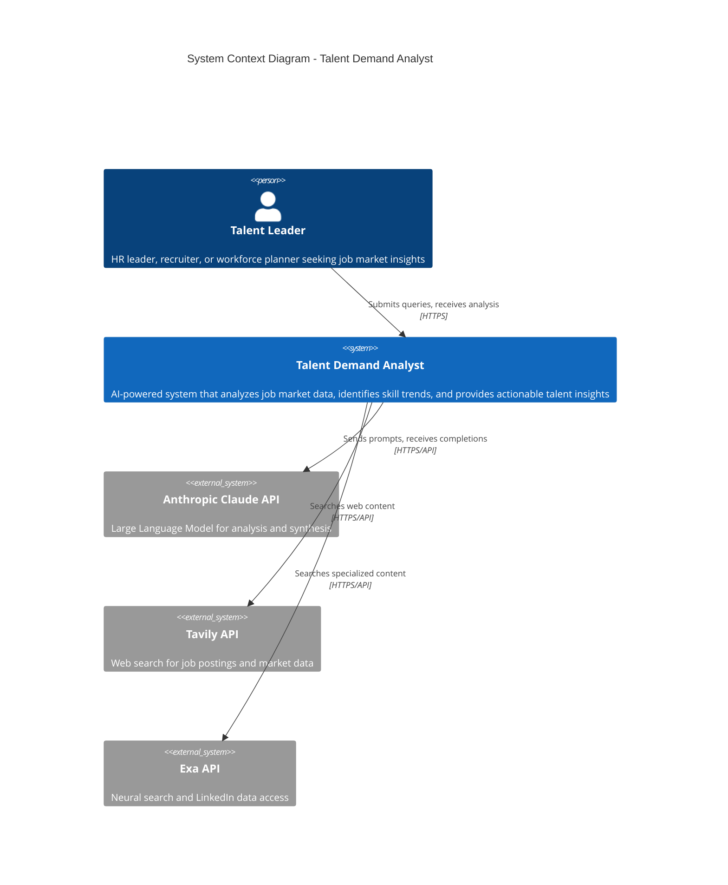

# C4 Level 1: System Context Diagram

## Talent Demand Analyst - Context

This diagram shows the Talent Demand Analyst system and its relationship with users and external systems.

## Diagram Description

### Users

| Actor | Description |
|-------|-------------|
| Talent Leader | HR professionals, recruiters, and workforce planners who need job market intelligence to make strategic hiring decisions |

### Systems

| System | Description |
|--------|-------------|
| Talent Demand Analyst | The core system that processes user queries, orchestrates analysis across multiple AI agents, and synthesizes actionable insights |

### External Systems

| System | Purpose |
|--------|---------|
| Anthropic Claude API | Provides the LLM backbone (Claude Sonnet 4.5) for agent intelligence, analysis, and response generation |
| Tavily API | General web search capability for finding job postings, industry news, and market reports |
| Exa API | Neural/keyword search with specialized access to LinkedIn job and company data |

## Data Flows

1. **User → TDA:** Natural language queries about job market trends, skill demand, or industry analysis
2. **TDA → Claude:** Agent prompts and tool results for processing
3. **TDA → Tavily:** Web search queries for job postings and articles
4. **TDA → Exa:** Specialized searches for professional network data
5. **TDA → User:** Streaming analysis results with source citations

---

*C4 Context Diagram - Part of 7-layer documentation*
