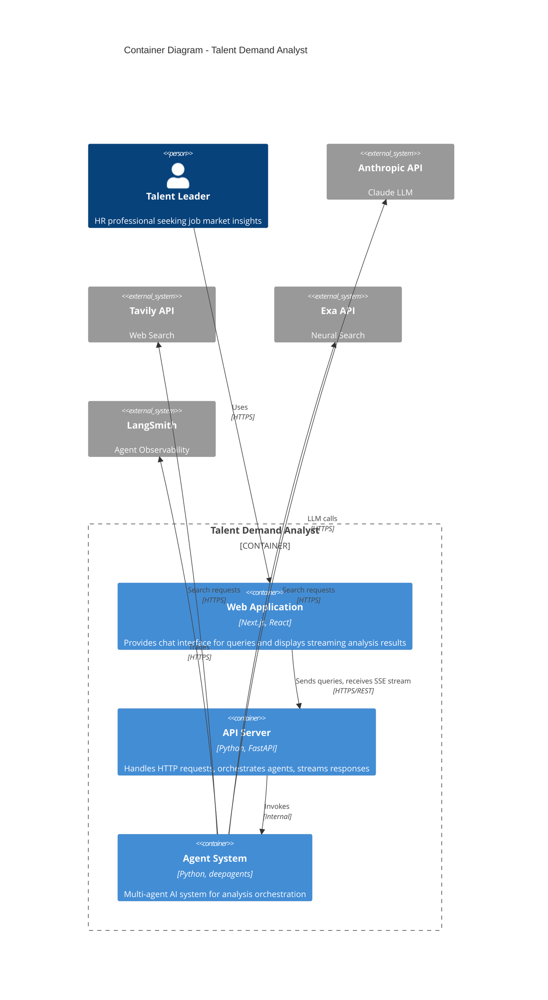

# C4 Level 2: Container Diagram

## Talent Demand Analyst - Containers

This diagram shows the high-level technical building blocks of the Talent Demand Analyst system.



## Container Descriptions

### Web Application (Frontend)

| Attribute | Value |
|-----------|-------|
| Technology | Next.js 14+, React 18+, Tailwind CSS |
| Hosting | Vercel |
| Responsibility | User interface, query input, streaming response display |
| Communication | HTTPS to API Server |

**Key Features:**
- Chat-style interface for natural language queries
- SSE streaming for real-time response display
- Source citation rendering with links
- Responsive design

### API Server (Backend)

| Attribute | Value |
|-----------|-------|
| Technology | Python 3.11+, FastAPI, Pydantic |
| Hosting | Railway |
| Responsibility | Request handling, validation, response streaming |
| Communication | HTTPS/SSE to Frontend, Internal to Agents |

**Key Endpoints:**
- `POST /api/chat` - Submit query, receive SSE stream
- `GET /api/health` - Health check
- `GET /api/health/ready` - Readiness check

### Agent System

| Attribute | Value |
|-----------|-------|
| Technology | Python, deepagents, LangChain tools |
| Location | Embedded in API Server |
| Responsibility | AI orchestration, analysis, synthesis |
| Communication | HTTPS to external APIs |

**Agents:**
- Main Coordinator Agent
- Job Posting Analyzer
- Skill Emergence Researcher
- Industry Report Synthesizer

## External Systems

| System | Purpose | Protocol |
|--------|---------|----------|
| Anthropic API | LLM inference for all agents | HTTPS REST |
| Tavily API | General web search | HTTPS REST |
| Exa API | Neural search, LinkedIn data | HTTPS REST |
| LangSmith | Agent tracing and debugging | HTTPS |

## Data Flows

```
User Query Flow:
┌──────────┐     ┌──────────┐     ┌──────────┐     ┌──────────┐
│ Frontend │────▶│   API    │────▶│  Agents  │────▶│ External │
│          │     │  Server  │     │          │     │   APIs   │
└──────────┘     └──────────┘     └──────────┘     └──────────┘
     │                │                │                │
     │   1. Query     │  2. Validate   │  3. Analyze    │
     │   (POST)       │  & Invoke      │  & Search      │
     │                │                │                │
     │◀──────────────│◀───────────────│◀───────────────│
     │   6. SSE      │  5. Stream     │  4. Results    │
     │   Tokens      │  Response      │                │
     └──────────────────────────────────────────────────
```

---

*C4 Container Diagram - Part of 7-layer documentation*
