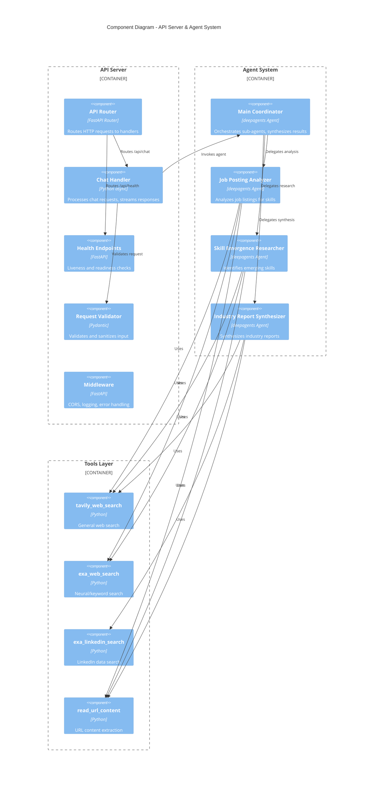

# C4 Level 3: Component Diagram

## Talent Demand Analyst - Components

This diagram shows the internal components of the API Server and Agent System.



## Component Descriptions

### API Server Components

#### API Router
- Routes incoming HTTP requests to appropriate handlers
- Defines endpoint paths and methods
- Handles request/response serialization

#### Chat Handler
```python
# Location: app/api/chat.py
@router.post("/chat")
async def chat(request: ChatRequest) -> StreamingResponse:
    """Main entry point for analysis queries."""
```
- Receives validated chat requests
- Invokes the coordinator agent
- Streams response tokens via SSE

#### Request Validator
```python
# Location: app/models/chat.py
class ChatRequest(BaseModel):
    message: str = Field(..., max_length=2000)
    conversation_id: Optional[str] = None
```
- Validates request structure and content
- Sanitizes user input
- Enforces size limits

#### Middleware Stack
- **CORS:** Allows frontend origin
- **Logging:** Request/response logging with correlation IDs
- **Error Handling:** Catches exceptions, returns formatted errors
- **Rate Limiting:** Per-user request limits

### Agent Components

#### Main Coordinator
```python
# Location: app/agents/coordinator.py
class TalentDemandAnalyst:
    """Orchestrates analysis across sub-agents."""

    async def analyze(self, query: str) -> AsyncIterator[Event]:
        # 1. Interpret query
        # 2. Determine which sub-agents needed
        # 3. Invoke sub-agents
        # 4. Synthesize results
        # 5. Stream final response
```

**Responsibilities:**
- Query interpretation and planning
- Sub-agent delegation
- Result synthesis
- Final response generation

#### Job Posting Analyzer
```python
# Location: app/agents/job_analyzer.py
```
- Searches job boards via Tavily and Exa
- Extracts skill requirements
- Identifies demand patterns
- Reports geographic concentrations

#### Skill Emergence Researcher
```python
# Location: app/agents/skill_researcher.py
```
- Monitors tech blogs and news
- Identifies accelerating skill mentions
- Categorizes by maturity stage
- Explains emergence drivers

#### Industry Report Synthesizer
```python
# Location: app/agents/report_synthesizer.py
```
- Searches industry reports
- Analyzes LinkedIn professional data
- Synthesizes multiple sources
- Identifies trends and themes

### Tools Layer

#### tavily_web_search
```python
@tool
async def tavily_web_search(query: str, max_results: int = 10) -> str:
    """Search web via Tavily API."""
```
- General web search capability
- Used by all sub-agents
- Returns formatted results with URLs

#### exa_web_search
```python
@tool
async def exa_web_search(
    query: str,
    search_type: str = "neural",
    max_results: int = 10
) -> str:
    """Search via Exa neural/keyword search."""
```
- Neural (semantic) or keyword search
- Better for technical content
- Autoprompt for query enhancement

#### exa_linkedin_search
```python
@tool
async def exa_linkedin_search(query: str, max_results: int = 10) -> str:
    """Search LinkedIn via Exa."""
```
- Scoped to linkedin.com domain
- Job postings and company pages
- Professional insights

#### read_url_content
```python
@tool
async def read_url_content(url: str) -> str:
    """Fetch and extract content from URL."""
```
- HTTP fetch with timeout
- HTML content extraction
- Truncation for large pages

## Component Interactions

### Query Processing Flow

```
1. Request Arrives
   │
   ▼
2. Middleware (CORS, Logging)
   │
   ▼
3. Router → Chat Handler
   │
   ▼
4. Validator (Check message)
   │
   ▼
5. Coordinator Agent
   │
   ├──▶ Job Analyzer ──▶ Tools ──▶ External APIs
   │         │
   │         ▼
   │    Sub-results
   │
   ├──▶ Skill Researcher ──▶ Tools ──▶ External APIs
   │         │
   │         ▼
   │    Sub-results
   │
   ├──▶ Report Synthesizer ──▶ Tools ──▶ External APIs
   │         │
   │         ▼
   │    Sub-results
   │
   ▼
6. Coordinator Synthesizes
   │
   ▼
7. Stream Response to Client
```

---

*C4 Component Diagram - Part of 7-layer documentation*
